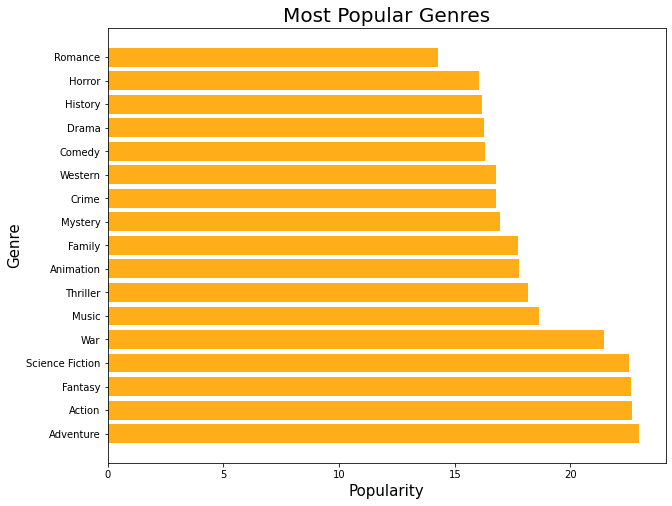

# Microsoft Film Analysis
## Overview
Microsoft has given us the duty of evaluating the state of the film business before it jumps on the bandwagon, due to the surge in original film production in giant companies. To arrive at findings, I examined the most popular genres and those with high audience votes, as well as the profitability of specific genres by looking at their return on investment and previewing the month of release.

## 1. Business Problem
Choosing how to make original video content that will differentiate Microsoft from competitors and draw and keep viewers could provide a business challenge. Microsoft must set itself apart from the competition and provide engaging content that appeals to viewers in order to take the lead in the market, since well-known companies like Sony and Disney already produce excellent unique content. This can be done by;

- Making large investments in marketing, sales, and talent acquisition,
- Developing a thorough awareness of the tastes and trends of the audience
Making informed decisions about monetization that strike a balance between the expenses of producing new content and income sources like advertising or subscriptions; 
- Acquiring a thorough awareness of audience patterns and preferences.

Three main criteria served as the foundation for my analysis.

- Which month of the year is best for a movie's release?
- How do revenues and production costs relate to each other?
- What kinds of genres are the most well-liked?

## 2. Data Understanding
The datasets used in this analysis were obtained from Box Office Mojo, The Numbers, and TMDB, three movie websites.

Five columns make up the first dataset, bom.movie_gross.csv, which includes the release year, studios, domestic and international revenue, and movie titles.

The names, release dates, and financial details of released movies, including production budget and global profit, are all included in the second dataset, tn.movie_budgets.csv. The ROI is the dataset's main variable, and the financial data columns were the main factor in the dataset's selection.

The genre codes, original language of the films, original movie titles, popularity metrics, release dates, and vote information are all included in the third dataset, tmdb.movies.csv. In order to determine which genres are more popular, I utilized this dataset to match genre codes to genre names that I found on the same website.

## 3. Approaches
I removed unnecessary data columns and collected dependable information from dependable sources. I substituted a value of 0 for any missing data. In order to find patterns and significant elements that go into making a good movie, I also made sure that any information I used came from reliable sources and employed both descriptive statistics and visual aids. This approach worked well for researching industry patterns and finding traits that high-grossing films had in common, allowing me to make informed recommendations.

## 4. Findings
The scatter plot study indicates that when the production budget rises, the global gross tends to rise as well.

### ROI
The scatter plot study indicates that there is a non-linear relationship between the production budget and the ROI, however there is an inverse link between the two. In particular, there is a negative relationship between the production budget and the return on investment for budgets between zero and one hundred million dollars. Nonetheless, it appears that there is no discernible relationship between the two factors for budgets between 100 and 300 million dollars.

The biggest return on investment was shown in movies released in April, followed by September and July. In contrast, when it comes to the quantity of movies released in those months, April and September come in last. Their greater ROI can be explained by this. Due to their comparatively high return on investment, movies released in July seem to be a good choice for release.

Thriller, Adventure, Comedy, Drama, and Action were the genres with the most films produced. Unfortunately, genres including history, music, thrillers, and mystery have relatively high return on investment and low production values. This phenomenon may be explained by the fact that these categories contain fewer films. ROI was unable to determine which genres would yield the most returns as a result. 

### Popularity
I looked over every film on TMDB and put them in the appropriate genres. I determined the five most prevalent genres based on my analysis, and they are as follows: 
1. Adventure
2. Take Action
3. Fantasy
4. Science Fiction
5. War  

### Competition

The top 5 studios in terms of gross income are
1. Walt Disney Studios
2. 20th Century Fox
3. Universal Pictures
4. Warner Bros. Pictures
5. Sony Pictures Entertainment (SPE)

## Conclusion
This study yields the following recommendations for the genres of films that are performing the best at the box office:   

- Microsoft can purchase its intellectual property rights from any of the big studios, including Walt Disney, Universal Pictures, Warner Brothers, 21st Century Fox, and Sony Pictures Entertainment, as it has no past expertise in the film industry.
- A little positive correlation exists between the production budget and return on investment of a film. 
- The worldwide gross of a film is positively correlated with its production expenditure. 
- July releases have a higher likelihood of being successful.
Action and adventure films are the most popular genres, although horror and music videos are more likely to make a bigger profit.

